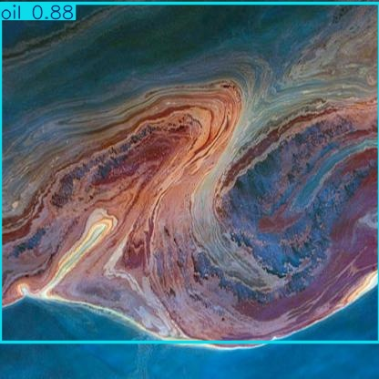

# Oil Spill Detection using YOLOv8

This project is a computer vision pipeline for detecting oil spills on aerial images using YOLOv8.  
Developed as a graduation project at Moscow Aviation Institute (2025).

## Description

- Performed object detection of oil spills using Ultralytics YOLOv8
- Ran inference on custom image datasets
- Converted annotation formats (YOLO → COCO)
- Visualized detection results with bounding boxes and confidence
- Integration with GUI (PyQt5)

## Tech Stack

- Python 3.10  
- PyTorch / Ultralytics YOLOv8  
- OpenCV, Pandas, Matplotlib  
- Google Colab

## Screenshots

  

## 🚀 Run the project

```bash
# Clone repository
git clone https://github.com/Malinovskii-Arsenii/oil-spill-detection-yolov8.git

# Install dependencies
pip install -r requirements.txt

# Open and run the notebook
jupyter notebook Diplom.ipynb
